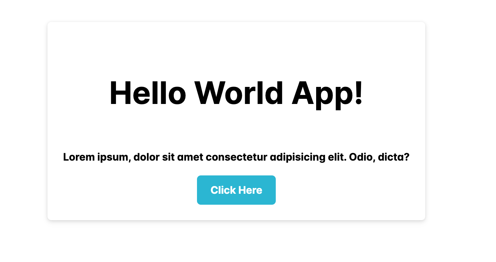

# React + Vite

This template provides a minimal setup to get React working in Vite with HMR and some ESLint rules.

Currently, two official plugins are available:

- [@vitejs/plugin-react](https://github.com/vitejs/vite-plugin-react/blob/main/packages/plugin-react/README.md) uses [Babel](https://babeljs.io/) for Fast Refresh
- [@vitejs/plugin-react-swc](https://github.com/vitejs/vite-plugin-react-swc) uses [SWC](https://swc.rs/) for Fast Refresh

# React Prime and Prime Flex Setup for react project

```jsx
// main.jsx
import React from 'react';
import ReactDOM from 'react-dom/client';
import App from './App.jsx';

import 'primereact/resources/themes/lara-light-cyan/theme.css';
import '/node_modules/primeflex/primeflex.css';

ReactDOM.createRoot(document.getElementById('root')).render(
  <React.StrictMode>
    <App />
  </React.StrictMode>
);
```

# Install dependency

`npm install primereact`<br>
`import "primereact/resources/themes/lara-light-cyan/theme.css";`<br><br>
`npm i primeflex`<br>
`/node_modules/primeflex/primeflex.css;`<br><br>
`npm install primeicons`<br>
`import 'primeicons/primeicons.css';`<br><br>

# Import docs link

`https://primereact.org/button/`<br>
`https://primeflex.org/fontsize`<br>
`https://primereact.org/icons/` <br>

## https://xerosource.com/why-api-is-called-twice-in-react/

## Prevent twice api call react useEffect

```jsx
// Approcah to prevent api call twice working and test
useEffect(() => {
  const todo = async () => {
    const resp = await axios.get(apiurl);
    console.log(resp.data);
  };
  return todo;
}, []);
```

## Handel the state correct way with previous value

```jsx
import React, { useState } from 'react';
import { Button } from 'primereact/button';
export default function DemoOne() {
  const [counter, setCounter] = useState(0);

  const handelClick = () => {
    // Get and update with the latest value and increase with 4 times
    setCounter((prevCount) => prevCount + 1);
    setCounter((prevCount) => prevCount + 1);
    setCounter((prevCount) => prevCount + 1);
    setCounter((prevCount) => prevCount + 1);

    // Unable to update the latest value
    // setCounter(counter + 1);
    // setCounter(counter + 1);
    // setCounter(counter + 1);
    // setCounter(counter + 1);
  };

  return (
    <div className='px-4 py-8 md:px-6 lg:px-8 flex justify-content-center align-items-center'>
      <div className='surface-card w-6 border-round shadow-2 p-4'>
        <p className='text-center '>{counter}</p>
        <div className='card flex justify-content-center'>
          <Button onClick={handelClick} label='Submit' />
        </div>
      </div>
    </div>
  );
}
```

## Conditional rendering with single return

```jsx
import React, { useState } from 'react';
import { Button } from 'primereact/button';
export default function DemoOne({ Id }) {
  const [something, setSomething] = useState('Hello World App!');

  return (
    <div className='px-4 py-8 md:px-6 lg:px-8 flex justify-content-center align-items-center'>
      <div className='surface-card w-6 border-round shadow-2 p-4'>
        {!Id ? (
          <p className='text-center font-bold'>No Id provided! 😎 </p>
        ) : (
          <>
            <p className='text-center font-bold'>{something}</p>
            <p className='text-center font-bold'>Post Id : {Id}</p>
            <div className='card flex justify-content-center'>
              <Button label='Check Post' />
            </div>
          </>
        )}
      </div>
    </div>
  );
}
```

## Updating the Object state

```jsx
import React, { useState } from 'react';
import { Button } from 'primereact/button';
import { InputText } from 'primereact/inputtext';
export default function DemoOne() {
  const [user, setUser] = useState({ name: '', company: '', age: 0 });

  // log user object
  console.log(user);

  const handelChange = (e) => {
    // Update the user object with previous value
    setUser((prev) => ({ ...prev, [e.target.name]: e.target.value }));
  };

  return (
    <div className='px-4 py-8 md:px-6 lg:px-8 flex gap-2 justify-content-center align-items-center'>
      <div className='surface-card w-6 border-round shadow-2 p-4'>
        <div className='card flex py-2 flex-wrap justify-content-center gap-3'>
          <span className='p-input-icon-left'>
            <i className='pi pi-search' />
            <InputText
              placeholder='Customer Name'
              onChange={handelChange}
              name='name'
            />
          </span>

          <span className='p-input-icon-right'>
            <i className='pi pi-spin pi-spinner' />
            <InputText
              placeholder='Company'
              onChange={handelChange}
              name='company'
            />
          </span>
        </div>
        <div className='card flex justify-content-center'>
          <Button label='Create User' />
        </div>
      </div>
      <div className='surface-card w-6 border-round shadow-2 p-4'>
        <p className='text-center font-bold'>{user.name}</p>
        <p className='text-center font-bold'>{user.company}</p>
        <div className='card flex justify-content-center'>
          <Button label='Check Post' />
        </div>
      </div>
    </div>
  );
}
```

## Information can be derived from state/props

```jsx
import React, { useState } from 'react';
import { Button } from 'primereact/button';
import { InputText } from 'primereact/inputtext';

const PRICE_PER_ITEM = 5;

export default function DemoOne() {
  const [quantity, setQuantity] = useState(1);
  // Calculate total price
  const totalPrice = quantity * PRICE_PER_ITEM;
  console.log(quantity);
  const handelChange = () => {
    setQuantity(quantity + 1);
  };

  return (
    <div className='px-4 py-8 md:px-6 lg:px-8 flex gap-2 justify-content-center align-items-center'>
      <div className='surface-card w-6 border-round shadow-2 p-4'>
        <p className='text-center font-bold'>Total Price : {totalPrice} /-</p>
        <div className='card flex justify-content-center'>
          <Button onClick={handelChange} label={`Add Item ${quantity}`} />
        </div>
      </div>
    </div>
  );
}
```

## Initalizing state with object and optmize twice api call

#### dummy json api https://dummyjson.com/

```jsx
import React, { useEffect, useState } from 'react';
import { Button } from 'primereact/button';
import { InputText } from 'primereact/inputtext';
import axios from 'axios';
import { ProgressSpinner } from 'primereact/progressspinner';

const PRICE_PER_ITEM = 5;

export default function DemoOne() {
  const dummyApi = 'https://dummyjson.com/posts/';
  // set initial value as null
  const [post, setPost] = useState(null);
  const [loading, setLoading] = useState(true);

  useEffect(() => {
    // Prevent twice api call
    const source = axios.CancelToken.source();
    const getPost = async () => {
      try {
        const resp = await axios.get(
          `${dummyApi}${Math.floor(Math.random() * 100)}`,
          {
            cancelToken: source.token,
          }
        );
        // console.log(resp.data);
        setPost(resp.data);
        setLoading(false);
      } catch (error) {
        console.log(error);
      }
    };
    getPost();
    return () => {
      source.cancel();
      console.log('Clean up api call');
    };
  }, []);

  const handelChange = () => {};

  return (
    <div className='px-4 py-8 md:px-6 lg:px-8 flex gap-2 justify-content-center align-items-center'>
      <div className='surface-card w-6 border-round shadow-2 p-4'>
        {loading ? (
          <div className='card flex justify-content-center'>
            <ProgressSpinner />
          </div>
        ) : (
          <>
            <p className='text-center font-bold'>{post.title}</p>
            <p className='text-center font-bold'>{post.body}</p>
          </>
        )}

        <div className='card flex justify-content-center'>
          <Button onClick={handelChange} label={`Find Post`} />
        </div>
      </div>
    </div>
  );
}
```

## Api Call in useEffect with button click efficent way

```jsx
import React, { useEffect, useState } from 'react';
import { Button } from 'primereact/button';
import { InputText } from 'primereact/inputtext';
import axios from 'axios';
import { ProgressSpinner } from 'primereact/progressspinner';

const PRICE_PER_ITEM = 5;
const DUMMY_API = 'https://dummyjson.com/posts/';
export default function DemoOne() {
  // Initial value for postId
  const [postId, setPostId] = useState(1);

  const handelChange = () => {
    // Pass a random postId
    setPostId(Math.floor(Math.random() * 100));
  };

  return (
    <div className='px-4 py-8 md:px-6 lg:px-8 flex gap-2 justify-content-center align-items-center'>
      <div className='surface-card w-6 sm:w-max border-round shadow-2 p-4'>
        <PostBody Id={postId} />
        <div className='card flex justify-content-center'>
          <Button onClick={handelChange} label='Show me a different post' />
        </div>
      </div>
    </div>
  );
}

export function PostBody({ Id }) {
  // set initial value as null
  const [post, setPost] = useState(null);
  const [loading, setLoading] = useState(true);

  useEffect(() => {
    setLoading(true);
    // Prevent twice api call
    const source = axios.CancelToken.source();
    const getPost = async () => {
      try {
        const resp = await axios.get(`${DUMMY_API}${Id}`, {
          cancelToken: source.token,
        });
        // console.log(resp.data);
        setPost(resp.data);
        setLoading(false);
      } catch (error) {
        console.log(error);
      }
    };
    getPost();
    return () => {
      source.cancel();
      console.log('Clean up api call');
    };
  }, [Id]);
  return (
    <>
      {loading ? (
        <div className='card flex justify-content-center py-3'>
          <ProgressSpinner strokeWidth='2' animationDuration='10s' />
        </div>
      ) : (
        <>
          <p className='text-center text-6xl font-bold'>{post.title}</p>
          <p className='text-center font-bold'>{post.body}</p>
        </>
      )}
    </>
  );
}
```

## Simple Card

```jsx
<div className='px-4 py-8 md:px-6 lg:px-8 flex gap-2 justify-content-center align-items-center'>
  <div className='surface-card w-6 sm:w-max border-round shadow-2 p-4'>
    <p className='text-center text-6xl font-bold'>Hello World App!</p>
    <p className='text-center font-bold'>
      Lorem ipsum, dolor sit amet consectetur adipisicing elit. Odio, dicta?
    </p>
    <div className='card flex justify-content-center'>
      <Button label='Click Here' />
    </div>
  </div>
</div>
```

##### Output:


